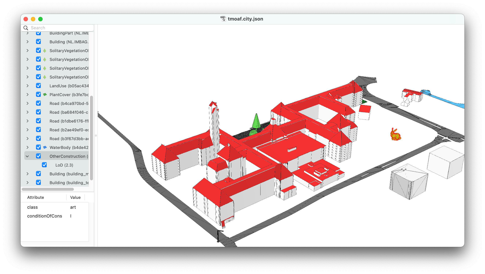

# the mother of all files

- [ ] all City Object types
    - [ ] BridgeConstructiveElement
    - [ ] BridgeFurniture
    - [ ] BridgeInstallation
    - [ ] BridgePart
    - [ ] BridgeRoom
    - [x] Building
    - [ ] BuildingConstructiveElement
    - [ ] BuildingFurniture
    - [x] BuildingInstallation
    - [x] BuildingPart
    - [ ] BuildingRoom
    - [ ] BuildingStorey
    - [ ] BuildingUnit
    - [x] CityFurniture
    - [x] CityObjectGroup
    - [ ] ExtensionObject
    - [ ] GenericCityObject
    - [x] LandUse
    - [x] OtherConstruction
    - [x] PlantCover
    - [ ] Railway
    - [x] Road
    - [x] SolitaryVegetationObject
    - [ ] TINRelief
    - [ ] TransportSquare
    - [ ] Tunnel
    - [ ] TunnelConstructiveElement
    - [ ] TunnelFurniture
    - [ ] TunnelHollowSpace
    - [ ] TunnelInstallation
    - [ ] TunnelPart
    - [x] WaterBody
    - [ ] Waterway
- [ ] all Geometric Objects
    - [x] "MultiPoint"
    - [ ] "MultiLineString"
    - [x] "MultiSurface"
    - [x] "CompositeSurface"
    - [x] "Solid"
    - [ ] "MultiSolid"
    - [x] "CompositeSolid"
    - [x] "GeometryInstance"
- [ ] +Extension 1
- [ ] +Extension 2
- [ ] +Extension 3
- [ ] +Extension 4
- [x] metadata
- [x] Semantic Surfaces
- [x] material
- [x] texture
- [x] Geometry Template
